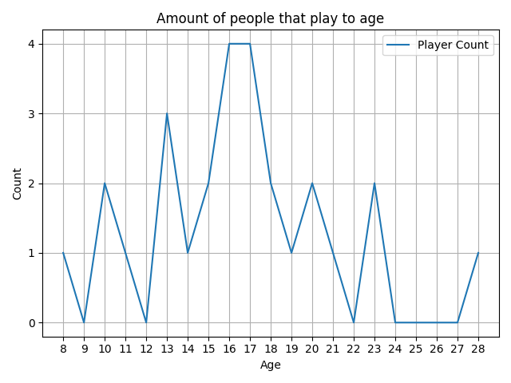

(This includes my submission)

**Average Highscore**: 2.3m, Mine: 2m

**Average age of an arras.io player**: 16.4 years old, I am 15.1~ years old

You can see theres a lot of teenagers playing and some adults too!

Dates of submissions:

Most people submitted on the 22th, which is the day i made the reddit post, with 19 submissions
Then, on the 21th, in which i made the form, 11 people submitted (I was asking on discord)
And at last, 2 people submitted a response on the 22th when the form was closed.

Note, that i live in an area with the timezone deferring 2 from the Greenwitch (GMT+2)
Most people submitted at 3pm at my time, with 9 people
The rest of the people then submitted in the later hours, ranging from 2pm to 7pm
3 people submitted a response early in the morning

Most people submitted a response on the 16th minute of the hour (4 people)

The second statistics are completely all over the place and not worth displaying.

The average person submitted a response on 21.03.2025 at 15:16:xx GMT+2 time